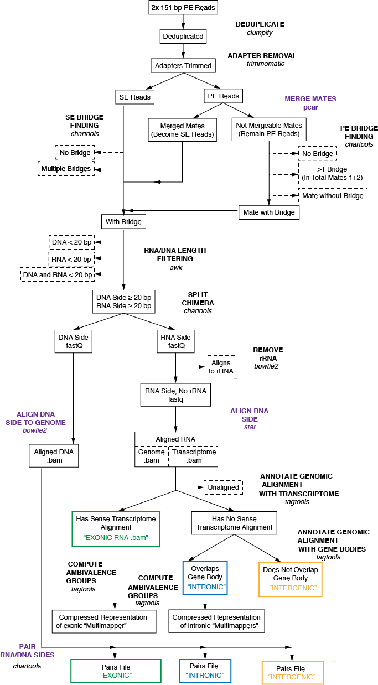

# ChAR-seq pipeline installation & setup

## Clone repositories & install 

`git clone https://github.com/straightlab/charseq-pipelines`

## Create conda environment from .yml file
`conda env create -f /path/to/this/repo/environment.yml`

`conda activate char`

## Download and install chartools and tagtools packages
`git clone https://github.com/straightlab/chartools`

`pip install -e /path/to/chartools/repo`

`git clone https://github.com/straightlab/tagtools`

`pip install -e /path/to/tagtools/repo`

## Install additional dependencies in new directory /path/to/char_software

- bbmap version 39.0
- STAR-2.7.2b
- bedGraphToBigWig version 2.9
- salmon v0.14.0

- add path to software & charseq scripts/resources to $PATH:

    - `export PATH=$PATH:/path/to/char_software`
    - `export PATH=$PATH:/path/to/char_software/bbmap`
    - `export PATH=$PATH:/path/to/char_software/salmon-latest_linux_x86_64/bin`
    - `export PATH=$PATH:/path/to/char_software/STAR-2.7.2b/source`
    - `export PATH=$PATH:/path/to/charseq-pipelines_repo/scripts`
    - `export PATH=$PATH:/path/to/charseq-pipelines_repo/resources`
    - `export PATH=$PATH:/path/to/chartools_repo/Jchartools`
    - `export PATH=$PATH:/path/to/chartools_repo/scripts`

## Load julia & add packages
###  Install julia 1.7 or 1.6 
- https://julialang.org/downloads/
- add to path:
    `export PATH="$PATH:/path/to/<Julia directory>/bin"`
- Create a file in your home directory ~/.julia/config/startup.jl, with the following content, to allow Julia to find this Jchartools package

    `push!(LOAD_PATH,"/path/to/chartools_repo/Jchartools")`

### Add packages

- Launch interactive shell: `julia`

- Within julia, press ] to enter pkg mode, and install the necessary packages by entering:

    `add FASTX` 
#(v1.2.0)

    `add CodecZlib`
#(v0.7.0)

    `add TranscodingStreams`
#(v0.9.6)

    `add ArgParse`
#(v1.1.4)

    `add BridgeFinder`

- You can check the version of each package you added by running the following:

    `using Pkg`
    
    `Pkg.status("ArgParse")`

- You can quit the interactive julia shell with CTRL-D

# How to run the pipeline
The pipelines are written in Snakemake and each pipeline consists in 3 files as described below. Simply copy these files to the desired run directory, edit the yaml configuration file and sample definition file appropiately, then simply execute snakemake

    conda activate char
    snakemake -pr -s pipeline.smk --configfile pipeline_config.yaml

The pipeline will generate output files into ./data

The 3 files used by the pipeline are:
- a snakemake file, pipeline.smk, which implements the pipeline steps. This file is portable across systems and do not need to be modified. There are no hardcoded sytems specific, sample specific, or tools configuration related parameters in this file.
- a yaml configuration file pipeline_config.yaml, which contains parameters for the various steps of the pipeline, such as configuration of the trimmer, aligners, read length cutoff, etc... Most parameters can be left unchanged but the paths to a few necessary resource files (such bowtie2 index, annotation files, etc..) are hardcoded and need to set up once.
- a sample definition file samples_def.yaml, which contains the list of samples to process with for each : the path to fastq files, the sequence of the bridge (which can be different for each sample), and the path to the adapters definition fasta file used for adapter trimming.

Important Notes:
- One should always execute the pipeline in dry-run mode first, using the `-n` snakemake option!
- If the pipeline is ran on a cluster, it is ok to do dry runs on a login node. Of course however, once ready to fire up the pipeline, do not do so on a login node. Instead, either create a sbatch script or directly launch snakemake on an allocated compute node.

# Preparation of annotation files
In order to run, the pipeline requires first creating annotation files for the genome of interest. These are used by tagtools to annote the reads with transcripts and gene names. The starting point to create these annotation files is a gff3 file for the genome of interest. Refer to xenopus_laevis example in the [notebooks](https://github.com/straightlab/charseq-pipelines/tree/main/notebooks/xenopus_laevis) folder

# Pipeline structure
The schematic below shows the steps of the pipeline for paired-end sequencing reads.
